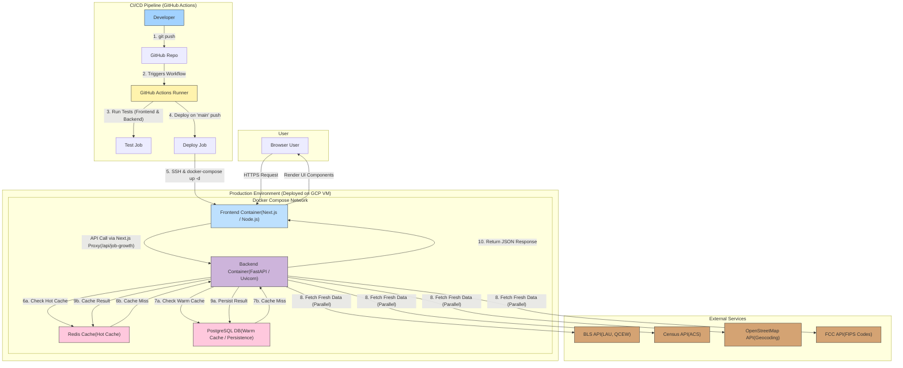

# Market Intelligence Platform

[](https://skillicons.dev)

This project is a full-stack web application designed to provide dynamic, on-demand real estate market intelligence. Given any U.S. address, it generates a detailed "Job Growth Market Card" by aggregating and analyzing data from multiple public APIs. It is built to be performant, scalable, and production-ready.

## Live Demo

**[Click Here](https://kb-realestate.existence.technology)**

## Key Features

- **Dynamic Market Analysis:** Enter any U.S. address to receive a detailed job growth report.
- **Multi-Granularity Data:** Provides data at both the hyper-local level (Census Tract/ZIP) and the broader County level for comprehensive context.
- **Data Projection:** Implements a projection model to estimate current local trends using more timely county-level data.
- **Comparison View:** Analyze and compare key economic indicators for multiple addresses side-by-side.
- **High-Performance Backend:** Asynchronous API calls and a multi-layer caching strategy ensure responses are delivered within seconds.
- **CI/CD Pipeline:** Automated testing and deployment pipeline using GitHub Actions.
- **Fully Containerized:** Dockerized services for consistent development, testing, and production environments.

## Architecture Overview

The system is designed as a modern, decoupled web application. The frontend communicates with a backend API, which orchestrates data fetching, caching, and analysis from various external services.



### Technical Deep Dive

1.  **Frontend (Next.js):**

    - Built with **Next.js**, **React**, and **TypeScript** for a robust, type-safe, and performant user interface.
    - **React Query (`@tanstack/react-query`)** is used for server state management, handling data fetching, caching on the client, and background refetching.
    - **Tailwind CSS** and **shadcn/ui** provide a modern, responsive, and accessible component library.
    - **Next.js Rewrites** are configured to proxy all `/api/*` requests to the backend service. This avoids CORS issues in production and abstracts the backend URL from the client.

2.  **Backend (FastAPI):**

    - Built with **FastAPI** for its high performance and native `async` support, which is critical for handling multiple I/O-bound network requests to external APIs efficiently.
    - All external API calls (to BLS, Census, etc.) are executed in parallel using `asyncio.gather`, significantly reducing the total response time.
    - **SQLAlchemy** with `asyncpg` is used for asynchronous database interaction, and **Alembic** manages database schema migrations.
    - The application is served by **Uvicorn**, a lightning-fast ASGI server.

3.  **Data & Caching Strategy:**
    A two-tier caching system is implemented to ensure fast response times and reduce redundant API calls to external services.

    - **Redis (Hot Cache):** An in-memory cache that provides sub-millisecond read times for frequently accessed addresses.
    - **PostgreSQL (Warm Cache / Persistence):** A persistent database that stores all successful API responses. If a request is not found in Redis, it is checked here before fetching fresh data. This adds resilience and ensures data is retained.

4.  **Containerization (Docker):**

    - The entire application stack (frontend, backend, database, cache) is defined in **Docker Compose**.
    - This guarantees a consistent environment across development, testing, and production, eliminating "it works on my machine" issues.
    - The backend container includes an `entrypoint.sh` script that automatically applies **Alembic database migrations** on startup, ensuring the database schema is always up-to-date.

5.  **CI/CD (GitHub Actions):**
    - A workflow is configured in `.github/workflows/ci-cd.yml`.
    - **On Pull Request:** The `test` job is triggered, using a matrix strategy to run tests for both the backend (`pytest`) and frontend (`vitest`) in parallel.
    - **On Push to `main`:** After tests pass, the `deploy` job is triggered. It securely connects to the production VM via SSH and runs a deployment script that pulls the latest code and restarts the services using Docker Compose.

## Tech Stack

| Component          | Technology / Library            | Purpose                                                          |
| ------------------ | ------------------------------- | ---------------------------------------------------------------- |
| **Frontend**       | Next.js, React, TypeScript      | Core framework for building a server-rendered, modern UI.        |
|                    | React Query                     | Server-state management, data fetching, and client-side caching. |
|                    | Tailwind CSS, shadcn/ui         | Styling and UI components.                                       |
|                    | Framer Motion                   | Animations and smooth user experience.                           |
|                    | Vitest, React Testing Library   | Unit and component testing.                                      |
| **Backend**        | FastAPI, Python 3.11            | High-performance, asynchronous API framework.                    |
|                    | Uvicorn                         | ASGI server for FastAPI.                                         |
|                    | SQLAlchemy (async), Alembic     | Asynchronous ORM and database schema migrations.                 |
|                    | Redis, `redis-py`               | In-memory caching (Hot Cache).                                   |
|                    | PostgreSQL, `asyncpg`           | Persistent data storage (Warm Cache).                            |
|                    | Pytest, `pytest-asyncio`        | Asynchronous testing framework.                                  |
| **Infrastructure** | Docker, Docker Compose          | Containerization and service orchestration.                      |
| **CI/CD**          | GitHub Actions                  | Automation for testing and deployment.                           |
| **External APIs**  | BLS, Census, OpenStreetMap, FCC | Primary data sources for economic and geographic information.    |

## Running Locally

To run this project on your local machine, you will need **Docker** and **Docker Desktop** installed.

1.  **Clone the Repository:**

    ```bash
    git clone https://github.com/kabeer2004/realestateassignment
    cd realestateassignment
    ```

2.  **Create Backend Environment File:**
    Navigate to the `backend` directory and create a `.env` file from the example.

    ```bash
    cd backend
    cp .env.example .env
    ```

    You will need to fill in your API keys for the BLS and Census services in this file.

3.  **Run the Application with Docker Compose:**
    From the root directory of the project, use the `docker-compose.local.yml` file, which is configured for local development (e.g., enabling frontend hot-reloading).

    ```bash
    docker-compose -f docker-compose.local.yml up --build -d
    ```

    - The `--build` flag will build the Docker images the first time you run it.
    - This command will start all services: frontend, backend, Postgres, and Redis.

4.  **Access the Application:**
    - Frontend: [http://localhost:3000](http://localhost:3000)
    - Backend API: [http://localhost:8000/docs](http://localhost:8000/docs) (for Swagger UI)

Database migrations are handled automatically by the `entrypoint.sh` script inside the backend container upon startup.

## Production Readiness & Future Improvements

This project serves as a strong foundation. To further enhance it for a large-scale production environment, the following steps would be prioritized:

- **Scalability & Reliability (Infrastructure):**
  - Migrate from a single VM to a managed, auto-scaling container platform like **Google Cloud Run** or **Google Kubernetes Engine (GKE)**.
  - Transition the database and cache to managed services like **Google Cloud SQL** and **Google Memorystore for Redis** for automated backups, high availability, and effortless scaling.
- **Observability:**
  - Integrate **structured logging** into the backend application.
  - Set up **Application Performance Monitoring (APM)** (e.g., using OpenTelemetry) and centralized monitoring (e.g., Google Cloud Monitoring) to track request latency, error rates, and resource usage.
- **Automation (Infrastructure as Code):**
  - Define all cloud infrastructure using **Terraform**. This makes the entire setup version-controlled, reproducible, and easy to manage.
- **Enhanced CI/CD:**
  - Add **linting, code formatting, and vulnerability scanning** steps to the pipeline.
  - Implement a **staging environment** to test deployments before promoting them to production.
